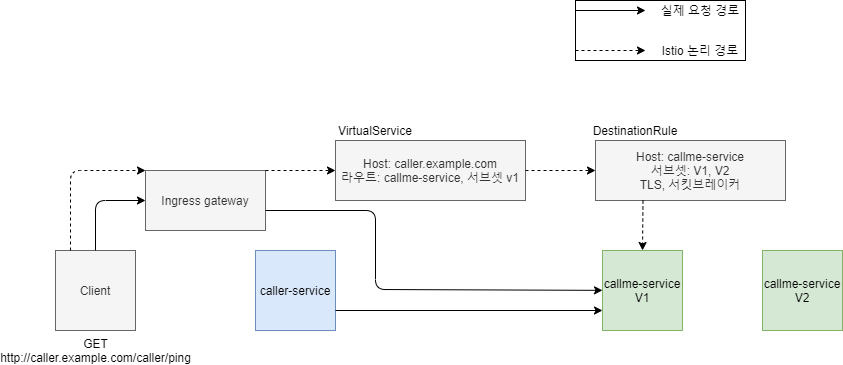

# istio 예제
## istio 트래픽 구조
   

1. Client에서 [GET] http://caller.example.com/caller/ping 을 요청한다.
2. Ingress gateway의 엔드포인트를 통해 트래픽이 전달된다.
3. VirtualService에서 어떤 서비스로 트래픽을 이동시킬지 라우팅이 진행된다.
4. DestianationRule에서는 해당 트래픽을 어떻게 전달할지 Rule을 정해 트래픽이 전달된다.

### 사용 환경
1. jdk 11
2. maven
3. spring boot 2.5.2
4. istio 1.11.3
5. gke
6. vscode 및 Cloudcode


### 개발환경 구성
1. git clone <url> 으로 개발소스 복제
2. 쿠버네티스 환경 구축
3. istio 설치
   1. % curl -L https://git.io/getLatestIstio | sh -
   2. istio 설치 폴더 이동 후 PATH 설정 % export PATH=$PWD/bin:$PATH
   3. istioctl install --set profile=demo -y 
4. sidecar injection 기능 활성화를 위한 라벨 추가   
    kubectl label namespace default istio-injection=enabled


### 프로그램 실행
Cloudcode 어플리케이션 실행   
    1. Cloudcode의 Cluster창의 헤더에서 + 버튼 (Add a Cluster to the Kubeconfig)를 누른다.   
    2. Google Kubernetes Engine을 선택하여 클러스터를 선택한 후 GCP 계정에 로그인하여 클러스터를 연결한다.   
    3. Cloudecode의 메뉴에서 Run on Kubernetes를 선택해 caller-service, callme-service의 skaffold.yaml파일을 각각 실행시킨다.

### 프로그램 테스트
1. Ping test
   1. controller의 /ping을 호출해본다.  
    ```   curl -v -H "Host:caller.example.com" http://34.146.231.170/caller/ping```


2. Fault Injection Test
   1. caller-service의 Istio-rules.yaml의 VirtualService 변경 (timeout 파라미터 부분 주석해제)
   2. callme-service의 Istio-rules.yaml의 VirtualService 변경 (fault 파라미터 부분 주석해제
   3. /caller/ping 호출   
    ```curl -v -H "Host:caller.example.com" http://34.146.231.170/caller/ping```

3. CircuitBreak Test   
   1. callme-service의 Istio-rules.yaml의 DestinationRule 변경 (trafficPolicy) 파라미터 부분 주석해제)
   2. callme-service의 복제본을 생성한다.    
   ```kubectl scale --replicas=2 deployment/callme-service-v2```

   3. ping-with-random-error를 발생시킨다.    
   ```curl -H "Host:caller.example.com" http://34.146.231.170/caller/ping-with-random-error```
   4. 해당 결과는 kiali에서 확인한다.   
    ```istioctl dashboard kiali```


